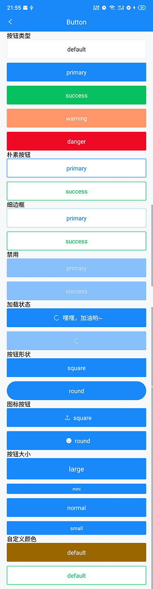
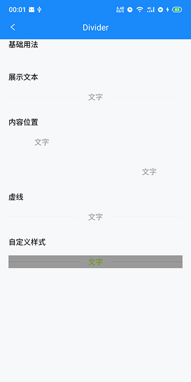
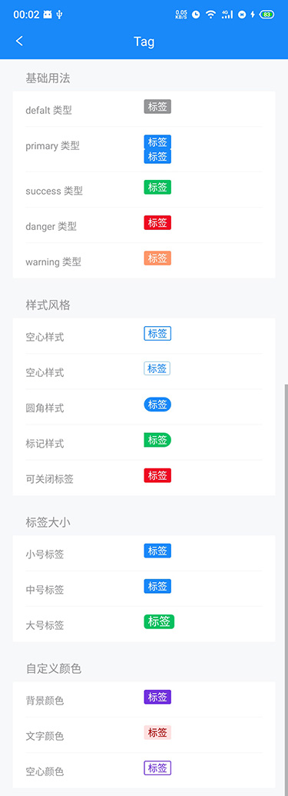
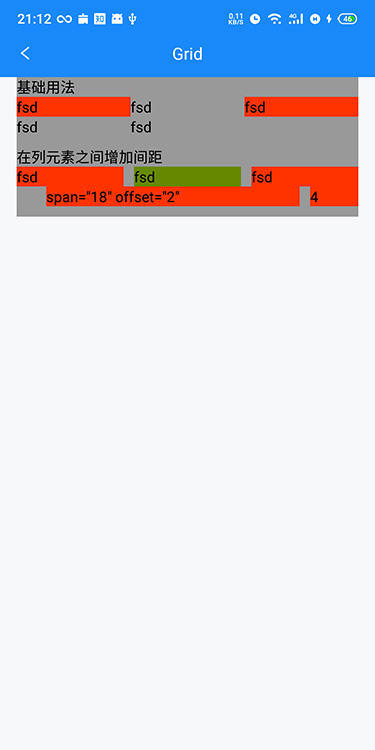

# XANT

按照 `vant` 的样子做的一个 React Native 的组件。

## 推荐组件

| 类型       | 推荐组件                                                     |
| :--------- | ------------------------------------------------------------ |
| 文件操作   | [react-native-fs](https://github.com/itinance/react-native-fs) \| [rn-fetch-blob]() |
| 路由       | [react-navigation](https://github.com/react-navigation/react-navigation) |
| 文件选择器 | [react-native-document-picker](https://github.com/rnmods/react-native-document-picker) |
| 图标       | [react-native-vector-icons](https://github.com/oblador/react-native-vector-icons) \| [@ant-design/icons-react-native](https://github.com/ant-design/ant-design-icons) \| [react-native-iconfont-cli](https://github.com/iconfont-cli/react-native-iconfont-cli) |
| 加解密     | [react-native-rsa-native](https://github.com/amitaymolko/react-native-rsa-native) \| [crypto-js@3.3.0](https://github.com/brix/crypto-js) |
| 异常处理   | [react-native-exception-handler](https://github.com/a7ul/react-native-exception-handler) |
| 压缩解压   | [react-native-zip-archive](https://github.com/mockingbot/react-native-zip-archive) |
| 图像       | [react-native-fast-image](https://github.com/DylanVann/react-native-fast-image) |

## 进度

### 基础组件

- [x] Button 按钮
- [x] Cell 单元格
- [ ] Icon 图标
- [x] Image 图片
- [x] Grid 栅格化
- [x] Popup 弹出层
- [x] Toast 轻提示

### 表单组件

- [ ] Calendar 日历
- [ ] Cascader 级联选择
- [ ] Checkbox 复选框
- [ ] DatetimePicker 时间选择
- [ ] Field 输入框
- [ ] Form 表单
- [ ] NumberKeyboard 数字键盘
- [ ] PasswordInput 密码输入框
- [ ] Picker 选择器
- [ ] Radio 单选框
- [ ] Rate 评分
- [ ] Search 搜索
- [ ] Slider 滑块
- [ ] Stepper 步进器
- [ ] Switch 开关
- [ ] Uploader 文件上传

### 反馈组件

- [ ] ActionSheet 动作面板
- [x] Dialog 弹出框
- [ ] DropdownMenu 下拉菜单
- [x] Loading 加载
- [x] Notify 消息提示
- [x] Overlay 遮罩层
- [ ] PullRefresh 下拉刷新
- [ ] ShareSheet 分享面板
- [ ] SwipeCell 滑动单元格

### 展示组件

- [x] Badge 徽标
- [ ] Circle 环形进度条
- [ ] Collapse 折叠面板
- [ ] CountDown 倒计时
- [x] Divider 分割线
- [ ] Empty 空状态
- [ ] ImagePreview 图片预览
- [ ] Lazyload 懒加载
- [ ] List 列表
- [ ] NoticeBar 通知栏
- [ ] Popover 气泡弹出框
- [ ] Progress 进度条
- [ ] Skeleton 骨架屏
- [ ] Steps 步骤条
- [ ] Sticky 粘性布局
- [ ] Swipe 轮播
- [x] Tag 标签

### 导航组件

- [x] ActionBar 动作栏
- [ ] IndexBar 索引栏
- [x] NavBar 导航栏
- [ ] Pagination 分页
- [ ] Sidebar 侧边导航
- [ ] Tab 标签页
- [ ] Tabbar 标签栏
- [ ] TreeSelect 分类选择

## 待改进项

- [ ] 部分组件属性继承 React Native 提供的组件，更贴近原组件使用（目前大部分只提供了 onPress 交互，还有其他很多可以用，可以向外暴露）
- [ ] 优化主题中未只用到的变量
- [ ] 时间单位，Vant 中部分组件使用毫秒，部分组件使用秒，在 Xant 中需要统一单位
- [ ] React Native 入口文件 `index.js` 需要重命名，`dumi` 生成动态依赖的时候会找到这个文件，不然每次更新 `dumi` 里面的 `.umi` 文件都要手动重命名一下

## 截图

### 按钮

### 图片

### 单元格

### 分割线

### 标签

### 栅格化

### 遮罩层

### 弹出层

### 加载

